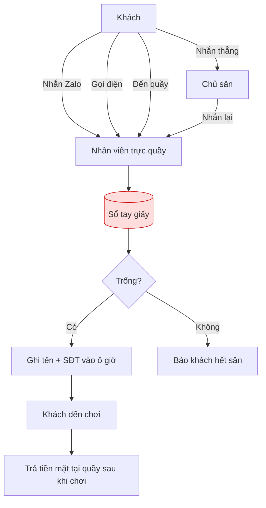
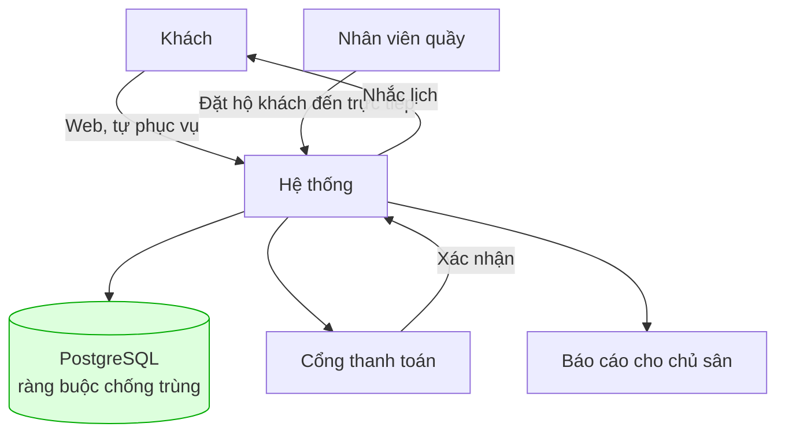

# 02 — Yêu cầu nghiệp vụ (Business Requirements)

> Tài liệu này trả lời câu hỏi **"vì sao doanh nghiệp cần hệ thống này"**, ở ngôn ngữ của khách hàng.
> Yêu cầu **chức năng** (hệ thống làm gì) nằm ở [03-functional-requirements.md](03-functional-requirements.md).

---

## 1. Quy trình hiện tại (As-Is)

### Điểm gãy của quy trình hiện tại

| # | Điểm gãy | Cơ chế gây lỗi |
|---|---|---|
| P1 | **Sổ tay là nguồn sự thật duy nhất nhưng không có khoá** | 2 nhân viên 2 ca cùng ghi 1 ô; chủ nhắn Zalo mà nhân viên chưa ghi kịp |
| P2 | **Không thu tiền trước** | Khách không mất gì khi bỏ kèo → no-show cao |
| P3 | **Dữ liệu không truy vấn được** | Muốn biết sân nào ế phải lật sổ đếm tay |
| P4 | **Phụ thuộc con người có mặt tại quầy** | Ngoài giờ trực thì không ai nhận đặt |

---

## 2. Quy trình mong muốn (To-Be)

Điểm khác biệt cốt lõi: **nguồn sự thật chuyển từ cuốn sổ sang cơ sở dữ liệu có ràng buộc**. Trùng lịch không còn là vấn đề quy trình mà trở thành điều **không thể xảy ra về mặt kỹ thuật**.

---

## 3. Yêu cầu nghiệp vụ

Mỗi yêu cầu có mã `BRQ-xx`, gắn với mục tiêu `G1..G5` ở [01-project-overview.md](01-project-overview.md).

| Mã | Yêu cầu nghiệp vụ | Mục tiêu | Ưu tiên |
|---|---|---|---|
| **BRQ-01** | Hệ thống phải đảm bảo **không bao giờ** có hai đơn hiệu lực trên cùng một sân, cùng khung giờ | G1 | 🔴 Bắt buộc |
| **BRQ-02** | Khách phải thanh toán trước khi đơn được xác nhận, để ràng buộc trách nhiệm | G2 | 🔴 Bắt buộc |
| **BRQ-03** | Khách quen lâu năm **không bị ép** chuyển khoản trước — phải có ngoại lệ được kiểm soát | G2 | 🔴 Bắt buộc |
| **BRQ-04** | Khách tự xem được sân trống và tự đặt mà không cần liên hệ nhân viên | G3 | 🔴 Bắt buộc |
| **BRQ-05** | Nhân viên quầy vẫn phải đặt hộ được cho khách đến trực tiếp hoặc gọi điện | G3 | 🔴 Bắt buộc |
| **BRQ-06** | Chủ sân xem được doanh thu theo chi nhánh và tỉ lệ lấp đầy theo sân / khung giờ | G4 | 🔴 Bắt buộc |
| **BRQ-07** | Nhóm thuê cố định hàng tuần phải đặt được một lần cho nhiều buổi, có giảm giá | G4 | 🔴 Bắt buộc |
| **BRQ-08** | Người góp vốn chỉ được xem dữ liệu của chi nhánh mình góp vốn | G5 | 🔴 Bắt buộc |
| **BRQ-09** | Hệ thống phải cho nhiều chủ sân khác nhau dùng chung mà dữ liệu cách ly tuyệt đối | G5 | 🔴 Bắt buộc |
| **BRQ-10** | Có chính sách hủy rõ ràng, hoàn tiền theo thời điểm hủy | G2 | 🟡 Nên có |
| **BRQ-11** | Khi sân phải đóng do sự cố, hệ thống hỗ trợ hủy và hoàn tiền cho các đơn bị ảnh hưởng | G1 | 🟡 Nên có |
| **BRQ-12** | Khách được nhắc lịch trước giờ chơi | G2 | 🟡 Nên có |
| **BRQ-13** | Chủ sân nhận diện được khách ruột để chăm sóc | G4 | 🔵 Có thì tốt |

---

## 4. Quy tắc kinh doanh do khách hàng đặt ra

| Nội dung | Chi tiết | Trở thành rule |
|---|---|---|
| **Đơn vị cho thuê** | Theo **giờ chẵn**, từ 05:00 đến 23:00. Không cho thuê 1,5 tiếng ("rắc rối sổ sách") | BR-01, BR-03 |
| **Khách chọn sân** | Khách quen đòi sân cụ thể ("sân 3 đèn sáng"), khách mới thì sân nào cũng được | BR-09 |
| **Giảm giá định kỳ** | Thuê cố định theo tuần, nguyên tháng → giảm **15%** | BR-23 |
| **Dịch vụ kèm** | Nước, vợt, cầu, gửi xe → **thu tiền mặt tại quầy, không đưa vào hệ thống** | Won't have |
| **Phân chia lợi nhuận Cụm 3** | Đối tác góp vốn 50%, chỉ được xem doanh thu Cụm 3 | BR-29, BR-30 |

---

## 5. Rủi ro nghiệp vụ

| Rủi ro | Ảnh hưởng | Xem thêm |
|---|---|---|
| Khách quen không chịu dùng web, vẫn nhắn Zalo | Mục tiêu G3 không đạt | [17-risk-analysis.md](17-risk-analysis.md) R-05 |
| Nhân viên quầy vẫn ghi sổ song song | Hai nguồn sự thật → trùng lịch quay lại | R-06 |
| Chính sách hoàn tiền gây tranh cãi với khách | Mất khách | R-07 |

---

## 6. Chỉ số đo lường thành công

| Chỉ số | Hiện tại | Mục tiêu sau 3 tháng go-live |
|---|---|---|
| Số ca trùng lịch / tháng | ~4–6 | **0** |
| Tỉ lệ no-show | ~15% | **< 5%** |
| Tỉ lệ đơn đặt online (không qua nhân viên) | 0% | **≥ 60%** |
| Thời gian chủ sân lấy được báo cáo doanh thu | ~1 giờ lật sổ | **< 10 giây** |
