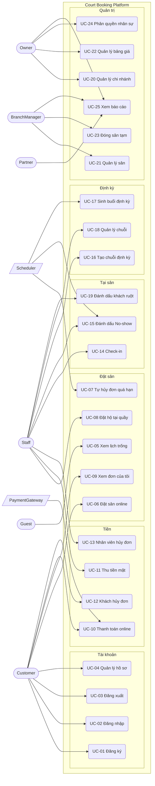

# 05 — Use Cases

> **Cách đọc:** bảng tổng hợp ở §3 liệt kê toàn bộ 25 use case. §4 đặc tả **chi tiết đầy đủ** cho 4 use case phức tạp nhất — đây là những luồng quyết định độ khó kỹ thuật của cả dự án.
> Use case mô tả **tương tác giữa người dùng và hệ thống**; ràng buộc chi tiết nằm ở [06-business-rules.md](06-business-rules.md).

---

## 1. Tác nhân (Actors)

| Tác nhân | Loại | Mô tả |
|---|---|---|
| **Guest** | Chính | Khách chưa đăng nhập. Chỉ xem lịch trống và bảng giá. |
| **Customer** | Chính | Khách đã đăng ký, định danh bằng số điện thoại. |
| **Staff** | Chính | Nhân viên quầy. Đặt hộ, check-in, thu tiền mặt. |
| **BranchManager** | Chính | Quản lý một cụm sân. Kế thừa quyền Staff trong phạm vi chi nhánh. |
| **Partner** | Chính | Người góp vốn. **Chỉ đọc báo cáo** của chi nhánh được cấp. |
| **Owner** | Chính | Chủ sở hữu. Toàn quyền trong tenant. |
| **PaymentGateway** | Phụ | VNPay — hệ thống ngoài, gửi webhook về. |
| **Scheduler** | Phụ | Hangfire — tác nhân **hệ thống**, kích hoạt các use case theo lịch. |
| **NotificationService** | Phụ | Kênh gửi Zalo/SMS. |

> 💡 `Scheduler` là tác nhân thật, không phải "cho có". Ba use case quan trọng (UC-07, UC-15, UC-17) được kích hoạt bởi thời gian chứ không phải bởi người — nếu bỏ sót loại tác nhân này, bạn sẽ quên mất toàn bộ mảng background job khi thiết kế.

---

## 2. Sơ đồ Use Case

---

## 3. Bảng tổng hợp Use Case

| Mã | Tên | Tác nhân chính | Ưu tiên | FR liên quan | Độ phức tạp |
|---|---|---|---|---|---|
| **UC-01** | Đăng ký tài khoản bằng SĐT | Customer | 🔴 | FR-01, FR-06 | Thấp |
| **UC-02** | Đăng nhập & làm mới phiên | Customer | 🔴 | FR-02, FR-03 | Trung bình |
| **UC-03** | Đăng xuất | Customer | 🔴 | FR-04 | Thấp |
| **UC-04** | Xem & cập nhật hồ sơ | Customer | 🟡 | FR-05 | Thấp |
| **UC-05** | Xem lịch trống theo ngày | Guest | 🔴 | FR-12→15 | Trung bình |
| **UC-06** | ⭐ **Đặt sân online** | Customer | 🔴 | FR-16→20 | **Cao** |
| **UC-07** | ⭐ Tự hủy đơn quá hạn giữ chỗ | Scheduler | 🔴 | FR-19 | Trung bình |
| **UC-08** | Đặt hộ khách tại quầy | Staff | 🔴 | FR-21 | Trung bình |
| **UC-09** | Xem danh sách & chi tiết đơn | Customer | 🔴 | FR-22, FR-23 | Thấp |
| **UC-10** | ⭐ **Thanh toán online & nhận webhook** | Customer, PaymentGateway | 🔴 | FR-25→29 | **Rất cao** |
| **UC-11** | Ghi nhận thu tiền mặt | Staff | 🔴 | FR-30 | Thấp |
| **UC-12** | ⭐ **Khách hủy đơn & hoàn tiền** | Customer | 🔴 | FR-31→33, FR-36 | **Cao** |
| **UC-13** | Nhân viên hủy đơn thay khách | Staff | 🔴 | FR-34 | Trung bình |
| **UC-14** | Check-in khách đến sân | Staff | 🔴 | FR-37, FR-38 | Thấp |
| **UC-15** | Đánh dấu No-show | Staff, Scheduler | 🔴 | FR-39, FR-40 | Trung bình |
| **UC-16** | Tạo chuỗi đặt định kỳ | Staff | 🟡 | FR-41 | Trung bình |
| **UC-17** | ⭐ **Sinh buổi định kỳ theo cửa sổ trượt** | Scheduler | 🟡 | FR-42, FR-43 | **Rất cao** |
| **UC-18** | Xem & hủy chuỗi định kỳ | Staff | 🟡 | FR-44, FR-45 | Trung bình |
| **UC-19** | Đánh dấu / gỡ khách ruột | Staff | 🔴 | FR-50 | Thấp |
| **UC-20** | Quản lý chi nhánh | Owner | 🔴 | FR-07 | Thấp |
| **UC-21** | Quản lý sân | Manager | 🔴 | FR-08 | Thấp |
| **UC-22** | Quản lý bảng giá | Owner | 🔴 | FR-09 | Trung bình |
| **UC-23** | Đóng sân tạm & xử lý đơn ảnh hưởng | Manager | 🟡 | FR-10, FR-11, FR-35 | Cao |
| **UC-24** | Phân quyền & phạm vi chi nhánh | Owner | 🔴 | FR-46, FR-47 | Trung bình |
| **UC-25** | Xem báo cáo | Owner, Manager, Partner | 🔴 | FR-52→56 | Trung bình |
| **UC-26** | ⭐ **Dời lịch (nguyên tử)** | Customer | 🔴 | FR-65, FR-66 | **Cao** |
| **UC-27** | Quản lý ghi đè mức hoàn tiền | BranchManager | 🔴 | FR-67 | Thấp |

---

## 4. Đặc tả chi tiết

### ⭐ UC-06 — Đặt sân online

| | |
|---|---|
| **Mã** | UC-06 |
| **Tác nhân chính** | Customer |
| **Tác nhân phụ** | — |
| **Mô tả** | Khách chọn sân và khung giờ trống, tạo đơn đặt sân. Đơn được giữ chỗ chờ thanh toán, hoặc xác nhận ngay nếu khách là khách ruột. |
| **Tần suất** | ~65 lần/ngày (≈60% tổng đơn) |
| **Trigger** | Khách bấm "Đặt sân" trên lưới lịch trống |

**Tiền điều kiện**
- Khách đã đăng nhập
- Các slot được chọn đang hiển thị là trống

**Hậu điều kiện (thành công)**
- Tạo `Booking` với trạng thái `PendingPayment` (hoặc `Confirmed` nếu khách ruột)
- Các `BookingSlot` tương ứng được tạo với `is_active = true` → **slot bị chiếm**
- Giá từng slot được **chốt cứng** vào `unit_price`
- Nếu `PendingPayment`: `hold_expires_at = now + 10 phút`

**Luồng chính**

| # | Tác nhân | Hành động |
|---|---|---|
| 1 | Customer | Chọn chi nhánh, ngày, sân và **1..N khung giờ liên tiếp** |
| 2 | Hệ thống | Kiểm tra slot liên tiếp trên **cùng một sân** *(BR-02)* |
| 3 | Hệ thống | Kiểm tra trong giờ mở cửa *(BR-03)*, không quá khứ và cách hiện tại ≥30 phút *(BR-04)*, không quá 60 ngày *(BR-05)* |
| 4 | Hệ thống | Kiểm tra sân không `Maintenance` và không nằm trong `court_closure` *(BR-08)* |
| 5 | Hệ thống | Tra `PriceRule` theo độ ưu tiên, tính tổng tiền |
| 6 | Hệ thống | Hiển thị bản tóm tắt: sân, khung giờ, giá từng giờ, tổng tiền |
| 7 | Customer | Xác nhận |
| 8 | Hệ thống | **Trong một transaction:** tạo `Booking` + `BookingSlot` + bản ghi `Outbox` |
| 9 | Hệ thống | Trả về đơn kèm `bookingCode` và hạn giữ chỗ |
| 10 | Customer | Được chuyển sang UC-10 (thanh toán) |

**Luồng thay thế**

| Mã | Điều kiện | Xử lý |
|---|---|---|
| **A1** | Khách có `CanPayAtCounter = true` *(BR-12)* | Bước 8 tạo đơn với `payment_mode = PayAtCounter`, trạng thái **`Confirmed`** ngay, không có hạn giữ chỗ. Bỏ qua bước 10. |
| **A2** | Khách chọn 1 slot duy nhất | Bỏ qua kiểm tra liên tiếp ở bước 2 |

**Luồng ngoại lệ**

| Mã | Điều kiện | Xử lý | HTTP |
|---|---|---|---|
| **E1** | 🔥 **Slot bị người khác đặt xen giữa bước 6 và 8** | CSDL từ chối do vi phạm `uq_slot_no_double_booking`. Hệ thống bắt `UniqueViolation`, trả về **đúng slot nào bị xung đột**, yêu cầu khách chọn lại. Đơn **không** được tạo. *(BR-06)* | **409** |
| **E2** | Slot không liên tiếp hoặc khác sân | Từ chối, giải thích rõ | 400 |
| **E3** | Ngoài giờ mở cửa / quá khứ / quá 60 ngày | Từ chối kèm lý do cụ thể | 400 |
| **E4** | Sân đang đóng tạm | Từ chối, hiển thị lý do đóng và khoảng thời gian | 409 |
| **E5** | Không tìm thấy quy tắc giá áp dụng | Từ chối, ghi log mức **Error** — đây là lỗi cấu hình của chủ sân | 500 |
| **E6** | Khách chưa đăng nhập | Chuyển sang UC-02 | 401 |

**Rule liên quan:** BR-01, BR-02, BR-03, BR-04, BR-05, **BR-06**, BR-07, BR-08, BR-09, BR-10, BR-12, BR-14

**NFR liên quan:** NFR-03 (p95 < 500ms) · **NFR-10 (không bao giờ trùng lịch)**

> 🔬 **Ghi chú kỹ thuật — điểm quan trọng nhất của use case này:**
> Bước 2–4 là kiểm tra ở **tầng ứng dụng**, phục vụ trải nghiệm người dùng. Chúng **không** đảm bảo BR-06. Khe hở giữa bước 6 (khách xem thấy trống) và bước 8 (ghi) là **TOCTOU** — chỉ ràng buộc ở tầng CSDL mới đóng được. Vì vậy **E1 không phải trường hợp hiếm cần bỏ qua, nó là luồng bắt buộc phải xử lý và phải có integration test.** Xem [ADR-0001](16-decision-records/0001-booking-concurrency-strategy.md).

---

### ⭐ UC-10 — Thanh toán online & nhận webhook

| | |
|---|---|
| **Mã** | UC-10 |
| **Tác nhân chính** | Customer |
| **Tác nhân phụ** | PaymentGateway (VNPay) |
| **Mô tả** | Khách thanh toán đơn đang giữ chỗ. Hệ thống nhận kết quả qua webhook, xác thực, và xác nhận đơn. |
| **Tần suất** | ~65 lần/ngày |
| **Trigger** | Khách bấm "Thanh toán" trên đơn `PendingPayment` |

**Tiền điều kiện**
- Đơn tồn tại, trạng thái `PendingPayment`, chưa quá `hold_expires_at`

**Hậu điều kiện (thành công)**
- `Payment.status = Succeeded`, `Booking.status = Confirmed`, `hold_expires_at = null`
- Sự kiện `BookingConfirmed` nằm trong bảng Outbox

**Luồng chính**

| # | Tác nhân | Hành động |
|---|---|---|
| 1 | Customer | Bấm "Thanh toán" |
| 2 | Hệ thống | Kiểm tra đơn còn hạn giữ chỗ |
| 3 | Hệ thống | Tạo bản ghi `Payment` trạng thái `Pending` kèm **`idempotency_key`** *(BR-15)* |
| 4 | Hệ thống | Tạo URL thanh toán VNPay đã ký, trả cho client |
| 5 | Customer | Được chuyển sang trang VNPay, hoàn tất thanh toán |
| 6 | PaymentGateway | Gửi **webhook** kết quả về hệ thống |
| 7 | Hệ thống | **Xác thực chữ ký** webhook *(NFR-26)* |
| 8 | Hệ thống | `INSERT` vào `payment_webhook_event` với `UNIQUE(provider, event_id)` |
| 9 | Hệ thống | **Trong một transaction:** cập nhật `Payment = Succeeded`, `Booking = Confirmed`, ghi `Outbox` sự kiện `BookingConfirmed`, ghi `audit_log` |
| 10 | Hệ thống | Đánh dấu `processed_at`, trả **200 OK** cho cổng thanh toán |
| 11 | Outbox worker | Đẩy sự kiện sang RabbitMQ → gửi thông báo cho khách |

**Luồng ngoại lệ**

| Mã | Điều kiện | Xử lý |
|---|---|---|
| **E1** | 🔥 **Webhook trùng lặp** (cổng retry) | Bước 8 vi phạm unique constraint → nhận biết đã xử lý → **trả 200 OK ngay, không xử lý lại** *(BR-15)* |
| **E2** | 🔥 **Chữ ký không hợp lệ** | Ghi log mức **Warning** kèm IP, trả **400**, **không** xử lý nghiệp vụ. *Đây là chốt chặn chống kẻ tấn công tự gửi webhook "đã thanh toán".* |
| **E3** | Thanh toán thất bại / khách hủy giữa chừng | `Payment = Failed`. Đơn **giữ nguyên** `PendingPayment`, khách được thử lại **trong thời hạn giữ chỗ còn lại** *(BR-11)* |
| **E4** | Webhook đến **sau khi** đơn đã `Expired` | Không xác nhận đơn. Tạo yêu cầu **hoàn tiền tự động**, ghi log mức Error, cảnh báo vận hành |
| **E5** | 🔥 **Xử lý nghiệp vụ ở bước 9 bị lỗi** | Vẫn trả **200 OK** cho cổng thanh toán *(nếu trả 500 sẽ gây bão retry)*. Ghi lỗi vào `payment_webhook_event.error`, xử lý lại bằng job riêng |
| **E6** | Khách không quay lại trang kết quả nhưng webhook đã về | Đơn vẫn được xác nhận đúng — **webhook là nguồn sự thật, không phải redirect của trình duyệt** |

**Rule liên quan:** BR-10, BR-11, BR-15
**NFR liên quan:** NFR-12, NFR-26, NFR-11 (Outbox)

> 🔬 **Ba cạm bẫy chết người trong use case này** — đây là nội dung được hỏi nhiều nhất khi phỏng vấn về tích hợp thanh toán:
> 1. **Tin webhook mà không xác thực chữ ký** → kẻ tấn công tự gửi "đã thanh toán" và chơi sân miễn phí.
> 2. **Trả 500 khi nghiệp vụ lỗi** → cổng thanh toán retry vô hạn.
> 3. **Coi redirect của trình duyệt là nguồn sự thật** → khách tắt trình duyệt trước khi quay lại thì đơn không bao giờ được xác nhận dù tiền đã trừ.

---

### ⭐ UC-12 — Khách hủy đơn & hoàn tiền

| | |
|---|---|
| **Mã** | UC-12 |
| **Tác nhân chính** | Customer |
| **Mô tả** | Khách hủy đơn đã đặt. Hệ thống tính mức hoàn theo thời điểm hủy, giải phóng slot và khởi tạo quy trình hoàn tiền bất đồng bộ. |
| **Tần suất** | ~8 lần/ngày |

**Tiền điều kiện**
- Đơn thuộc về khách, trạng thái ∈ {`PendingPayment`, `Confirmed`} *(BR-17)*

**Hậu điều kiện (thành công)**
- `Booking.status = Cancelled`, `cancelled_at` được ghi
- **Toàn bộ `BookingSlot.is_active = false` → slot được giải phóng ngay**
- Nếu đã trả tiền: `Refund` được tạo với trạng thái `Pending`

**Luồng chính**

| # | Tác nhân | Hành động |
|---|---|---|
| 1 | Customer | Chọn đơn, bấm "Hủy" |
| 2 | Hệ thống | Kiểm tra quyền sở hữu và trạng thái *(BR-17)* |
| 3 | Hệ thống | Tính khoảng cách tới giờ chơi → xác định mức hoàn *(BR-16)*: ≥24h → 100% · 4–24h → 50% · <4h → 0% |
| 3b | Hệ thống | 🔀 **Đưa ra HAI lựa chọn** *(BR-34)*: **hủy** (kèm số tiền hoàn) hoặc **dời lịch** (nếu còn trong cửa sổ `N` giờ — BR-36) |
| 4 | Hệ thống | 🔴 **Hiển thị rõ số tiền được hoàn và yêu cầu xác nhận lại** *(FR-32)* |
| 5 | Customer | Chọn **hủy** và xác nhận · *(chọn dời lịch → chuyển sang **UC-26**)* |
| 6 | Hệ thống | **Trong một transaction:** `Booking.Cancel()` → đặt trạng thái, **giải phóng toàn bộ slot**, tạo `Refund` nếu có tiền, ghi `Outbox` + `audit_log` |
| 7 | Refund worker | Gọi API hoàn tiền của cổng, cập nhật `Refund.status` |
| 8 | Hệ thống | Thông báo kết quả cho khách |

**Luồng thay thế**

| Mã | Điều kiện | Xử lý |
|---|---|---|
| **A1** | Đơn `PendingPayment` chưa trả tiền | Bỏ qua bước 3, 7. Hủy thẳng, không tạo `Refund` |
| **A2** | Đơn `PayAtCounter` chưa thu tiền | Hủy thẳng, không hoàn |
| **A3** | Đơn thuộc chuỗi định kỳ | Chỉ hủy **buổi này**, chuỗi và các buổi khác không đổi *(BR-26)* |

**Luồng ngoại lệ**

| Mã | Điều kiện | Xử lý | HTTP |
|---|---|---|---|
| **E1** | Trạng thái đã là `CheckedIn`/`Completed`/`NoShow`/`Cancelled` | Từ chối *(BR-17)* | 409 |
| **E2** | Đơn không thuộc về khách | Từ chối — **không tiết lộ đơn có tồn tại hay không** | 404 |
| **E3** | 🔥 **API hoàn tiền của cổng thất bại** | `Refund` giữ `Pending`, retry có backoff. **Đơn vẫn ở trạng thái `Cancelled`, slot vẫn được giải phóng** *(BR-19)* — không giữ sân của khách làm con tin vì lỗi của bên thứ ba |
| **E4** | Đã qua giờ bắt đầu | Từ chối hủy, chuyển thành luồng No-show (UC-15) | 409 |

**Rule liên quan:** BR-06, BR-16, BR-17, BR-19, BR-26, BR-32

> 🔬 **Điểm thiết kế quan trọng:** hủy đơn và hoàn tiền được **tách rời**. Nhiều người gộp làm một, dẫn tới: cổng thanh toán lỗi → không hủy được đơn → sân bị khoá vô ích. Tách ra thì lỗi của bên thứ ba không lan sang nghiệp vụ lõi. Đây là ứng dụng của nguyên tắc **lỗi cục bộ không làm hỏng toàn cục**.

---

### ⭐ UC-17 — Sinh buổi định kỳ theo cửa sổ trượt

| | |
|---|---|
| **Mã** | UC-17 |
| **Tác nhân chính** | **Scheduler** (Hangfire) |
| **Mô tả** | Job chạy hàng tuần, sinh trước các buổi của mọi chuỗi định kỳ đang hoạt động trong cửa sổ 8 tuần tới. |
| **Tần suất** | 1 lần/tuần |
| **Trigger** | Lịch cron hàng tuần |

**Tiền điều kiện**
- Tồn tại `RecurringSeries` có `status = Active`

**Hậu điều kiện**
- Các `Booking` con được tạo tới mốc `hôm nay + 8 tuần`
- `series.generated_until` được cập nhật
- Các buổi bị xung đột được ghi log và thông báo, **chuỗi vẫn hoạt động bình thường**

**Luồng chính**

| # | Hành động |
|---|---|
| 1 | Lấy các series `Active` có `generated_until < hôm nay + 8 tuần` |
| 2 | Với **mỗi** series, tính danh sách ngày cần sinh theo `day_of_week` |
| 3 | Với **mỗi** ngày: thử tạo `Booking` + `BookingSlot`, áp `discount_percent`, `payment_mode = PayAtCounter` *(BR-27)* |
| 4 | Cập nhật `series.generated_until` |
| 5 | Gộp danh sách buổi bị bỏ qua, gửi **một** thông báo tổng hợp cho khách và chủ sân |

**Luồng ngoại lệ**

| Mã | Điều kiện | Xử lý |
|---|---|---|
| **E1** | 🔥 **Slot đã bị người khác đặt** | **Bỏ qua đúng buổi đó**, ghi log, thêm vào danh sách thông báo. **Tiếp tục sinh các buổi còn lại.** Tuyệt đối **không** rollback cả chuỗi *(BR-25)* |
| **E2** | Buổi rơi vào khoảng `court_closure` | Bỏ qua như E1, lý do "sân đóng" |
| **E3** | Sân đã bị vô hiệu hoá / xoá mềm | Tạm dừng series, cảnh báo chủ sân |
| **E4** | 🔥 **Job chạy hai lần cùng lúc** | Phải **idempotent**: dựa vào `generated_until` + unique index chống trùng. Chạy 2 lần không được sinh buổi trùng |
| **E5** | Job chết giữa chừng | Lần chạy sau tiếp tục từ `generated_until` — **không** sinh lại từ đầu |

**Rule liên quan:** BR-06, BR-23, BR-24, BR-25, BR-27

> 🔬 **Vì sao use case này khó nhất dự án:** nó là giao điểm của **batch processing** + **concurrency** + **xử lý lỗi cục bộ** + **idempotency**. Sai một trong bốn thứ đó là hỏng. Đồng thời nhóm khách định kỳ chiếm **~40% doanh thu** — nghĩa là đây **không** phải tính năng phụ.

---

### ⭐ UC-26 — Dời lịch (nguyên tử)

| | |
|---|---|
| **Mã** | UC-26 |
| **Tác nhân chính** | Customer |
| **Mô tả** | Khách đổi đơn sang khung giờ / ngày / sân khác trong **một thao tác nguyên tử**. Slot mới bị chiếm thì đơn cũ **không hề bị đụng tới**. |
| **Tần suất** | ~5 lần/ngày (ước tính) |
| **Trigger** | Khách chọn "Dời lịch" ở UC-12 bước 3b |

**Tiền điều kiện**
- Đơn thuộc về khách, trạng thái `Confirmed`
- Còn cách giờ chơi ≥ `N` giờ *(`tenant.reschedule_window_hours`, mặc định 2 — BR-36)*
- `reschedule_count` < `tenant.max_reschedule_count` *(mặc định 2 — BR-38)*

**Hậu điều kiện (thành công)**
- Slot mới bị chiếm, slot cũ được giải phóng — **trong cùng một transaction**
- `booking.start_utc` / `end_utc` cập nhật, `reschedule_count` tăng 1
- `no_show_count` **không đổi** *(BR-42)*
- Sự kiện `BookingRescheduled` nằm trong Outbox

**Luồng chính**

| # | Tác nhân | Hành động |
|---|---|---|
| 1 | Customer | Chọn đơn, bấm "Dời lịch" |
| 2 | Hệ thống | Kiểm tra cửa sổ thời gian *(BR-36)* và số lần đã dời *(BR-38)* |
| 3 | Hệ thống | Hiển thị lịch trống, cho chọn khung giờ / ngày / sân mới *(BR-39: cùng chi nhánh)* |
| 4 | Customer | Chọn slot mới |
| 5 | Hệ thống | Tính giá slot mới. Đắt hơn → hiển thị số tiền phải bù. Rẻ hơn → báo rõ **không hoàn chênh lệch** *(BR-38)* |
| 6 | Customer | Xác nhận (và thanh toán phần bù nếu có — **xong TRƯỚC khi mở transaction**) |
| 7 | Hệ thống | 🔒 **Trong MỘT transaction:** `INSERT` slot mới → `UPDATE` slot cũ `is_active = false` → cập nhật `booking` → ghi `Outbox` + `audit_log` |
| 8 | Hệ thống | Trả về đơn đã cập nhật, giữ nguyên `booking_code` |

**Luồng ngoại lệ**

| Mã | Điều kiện | Xử lý | HTTP |
|---|---|---|---|
| **E1** | 🔥 **Slot mới bị người khác chiếm giữa bước 4 và 7** | `uq_slot_no_double_booking` từ chối → **rollback toàn bộ transaction**. Đơn cũ giữ nguyên `Confirmed`, slot cũ vẫn bị giữ. Khách được yêu cầu chọn slot khác. **Khách không mất gì.** *(BR-37)* | **409** |
| **E2** | Đã dời đủ số lần cho phép | Từ chối, gợi ý hủy theo BR-16 | 422 |
| **E3** | Ngoài cửa sổ `N` giờ | Từ chối, chỉ còn lựa chọn hủy | 422 |
| **E4** | Slot mới cách hiện tại < `N` giờ | Từ chối — chặn lách chính sách *(BR-38)* | 422 |
| **E5** | Slot mới đắt hơn, khách chưa bù tiền | Từ chối, chuyển sang luồng thanh toán bổ sung | 402 |
| **E6** | Slot mới ở **chi nhánh khác** | Từ chối *(BR-39, v1)* | 422 |
| **E7** | Slot mới vi phạm thời lượng tối thiểu khung giờ đó | Từ chối *(BR-33)* | 422 |
| **E8** | Đơn thuộc chuỗi định kỳ | ✅ Cho phép — chỉ dời **buổi này**, chuỗi không đổi *(BR-39, BR-26)* | — |

**Rule liên quan:** BR-33, BR-34, **BR-36, BR-37, BR-38, BR-39, BR-42**

> 🔬 **Điểm mấu chốt — vì sao KHÔNG dùng "hủy rồi đặt lại":**
> Nếu tách làm hai lời gọi API, giữa lúc hủy và lúc đặt lại, **cả hai slot đều có thể mất** — slot cũ bị người khác lấy, slot mới cũng bị người khác lấy. Khách trắng tay đúng vào giờ cao điểm.
> Làm trong một transaction thì `UniqueViolation` gây rollback, đơn cũ nguyên vẹn. **Cùng một partial unique index của [ADR-0001](16-decision-records/0001-booking-concurrency-strategy.md) làm luôn việc này — không cần thêm cơ chế nào.** Xem [ADR-0003](16-decision-records/0003-atomic-reschedule.md).
>
> ⚠️ **Bước 6 phải hoàn tất TRƯỚC bước 7.** Tuyệt đối không gọi cổng thanh toán bên trong transaction — giữ khoá CSDL trong khi chờ mạng bên thứ ba là công thức gây timeout và deadlock.

---

### UC-27 — Quản lý ghi đè mức hoàn tiền

| | |
|---|---|
| **Mã** | UC-27 |
| **Tác nhân chính** | BranchManager |
| **Mô tả** | Can thiệp vào mức hoàn tiền tự động cho một đơn đã hủy — hoàn nhiều hơn, ít hơn, hoặc từ chối hoàn. |
| **Tần suất** | ~2 lần/tuần — **ngoại lệ, không phải quy trình** *(BR-41)* |

**Tiền điều kiện**
- Đơn ở trạng thái `Cancelled`, thuộc **chi nhánh trong phạm vi** của người thao tác *(BR-29)*
- Yêu cầu hoàn tiền chưa ở trạng thái `Succeeded`

**Luồng chính**

| # | Tác nhân | Hành động |
|---|---|---|
| 1 | BranchManager | Mở đơn đã hủy, xem mức hoàn tự động theo BR-16 |
| 2 | BranchManager | Nhập mức hoàn mới ∈ `[0, số tiền đã trả]` + **lý do bắt buộc** |
| 3 | Hệ thống | Kiểm tra quyền **và phạm vi chi nhánh** *(BR-29, BR-40)* |
| 4 | Hệ thống | Ghi `refund_override_amount`, `refund_override_by`, `refund_override_reason` + **`audit_log`** *(BR-32)* |
| 5 | Hệ thống | Cập nhật `Refund.amount`, tiếp tục quy trình hoàn bất đồng bộ |

**Luồng ngoại lệ**

| Mã | Điều kiện | Xử lý | HTTP |
|---|---|---|---|
| **E1** | Staff (không phải Manager) thao tác | Từ chối | 403 |
| **E2** | Manager thao tác trên chi nhánh **ngoài phạm vi** | Từ chối *(chống IDOR)* | 403 / 404 |
| **E3** | Không nhập lý do | Từ chối *(BR-40)* | 400 |
| **E4** | Mức hoàn > số tiền đã trả | Từ chối | 422 |
| **E5** | Hoàn tiền đã `Succeeded` | Từ chối — không thể ghi đè việc đã xong | 409 |

**Rule liên quan:** BR-29, BR-30, BR-32, **BR-40, BR-41**

> 🔬 **Vì sao thiết kế theo kiểu "ghi đè" chứ không phải "duyệt từng đơn":**
> Nếu bắt quản lý duyệt **mọi** yêu cầu hoàn tiền, hệ thống mất tính tự phục vụ — mục tiêu **G3** *(≥60% đơn tự động)* bị phá, khách phải chờ hàng giờ, và nhân viên gánh thêm ~8 ca mỗi ngày.
> Mẫu đúng là **chính sách chạy tự động + con người xử lý ngoại lệ**. Quản lý vẫn có toàn quyền quyết định, chỉ là không phải bấm nút cho từng đơn bình thường.

---

## 5. Ma trận Use Case × Tác nhân

| UC | Guest | Customer | Staff | Manager | Partner | Owner | Scheduler | Gateway |
|---|:--:|:--:|:--:|:--:|:--:|:--:|:--:|:--:|
| UC-01…04 | | ✅ | ✅ | ✅ | ✅ | ✅ | | |
| UC-05 | ✅ | ✅ | ✅ | ✅ | ✅ | ✅ | | |
| UC-06 | | ✅ | ✅ | ✅ | | ✅ | | |
| UC-07 | | | | | | | ✅ | |
| UC-08 | | | 🔶 | 🔶 | | ✅ | | |
| UC-09 | | ✅ | 🔶 | 🔶 | | ✅ | | |
| UC-10 | | ✅ | | | | ✅ | | ✅ |
| UC-11 | | | 🔶 | 🔶 | | ✅ | | |
| UC-12 | | ✅ | | | | ✅ | | |
| UC-13 | | | 🔶 | 🔶 | | ✅ | | |
| UC-14, 15 | | | 🔶 | 🔶 | | ✅ | ✅ | |
| UC-16, 18 | | | 🔶 | 🔶 | | ✅ | | |
| UC-17 | | | | | | | ✅ | |
| UC-19 | | | | 🔶 | | ✅ | | |
| UC-20, 22, 24 | | | | | | ✅ | | |
| UC-21, 23 | | | | 🔶 | | ✅ | | |
| UC-25 | | | | 🔶 | 🔶 | ✅ | | |
| **UC-26** | | ✅ | 🔶 | 🔶 | | ✅ | | |
| **UC-27** | | | | 🔶 | | ✅ | | |

**Chú thích:** ✅ toàn tenant · 🔶 giới hạn trong phạm vi chi nhánh được cấp

---

## 6. Use case cần integration test bắt buộc

| UC | Vì sao bắt buộc |
|---|---|
| **UC-06 / E1** | Chứng minh BR-06 không thể bị vi phạm — bắn N request song song |
| **UC-10 / E1, E2** | Webhook trùng + chữ ký sai |
| **UC-12 / E3** | Cổng hoàn tiền lỗi mà đơn vẫn hủy được |
| **UC-17 / E1, E4** | Buổi trùng bị bỏ qua nhưng chuỗi vẫn chạy; job chạy 2 lần không sinh trùng |
| **UC-25** | Partner **không** thấy được dữ liệu chi nhánh ngoài phạm vi *(chống rò rỉ)* |
| **UC-26 / E1** | ⭐ Dời lịch mà slot mới bị chiếm → 409, **đơn cũ vẫn `Confirmed` và slot cũ vẫn bị giữ** *(BR-37)* |
| **UC-26 / E2** | Dời lần thứ 3 → bị từ chối *(BR-38)* |
| **UC-27 / E2** | Manager ghi đè hoàn tiền ở chi nhánh ngoài phạm vi → 403 *(chống IDOR)* |
