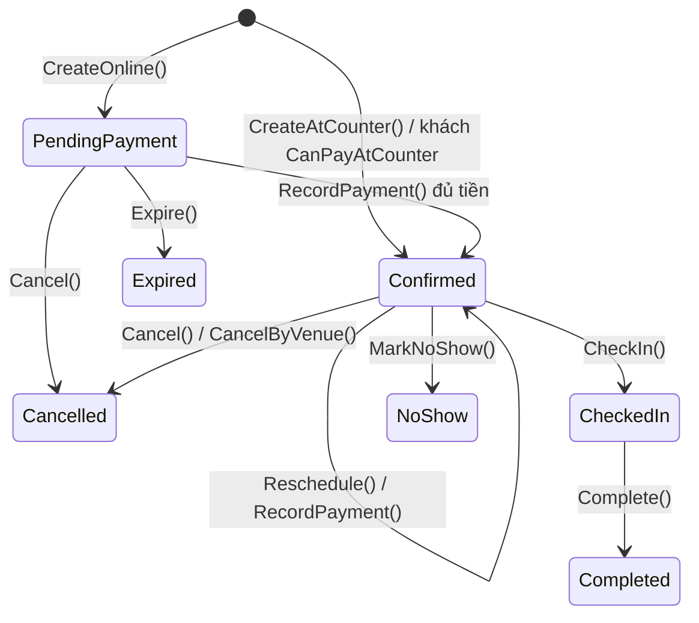
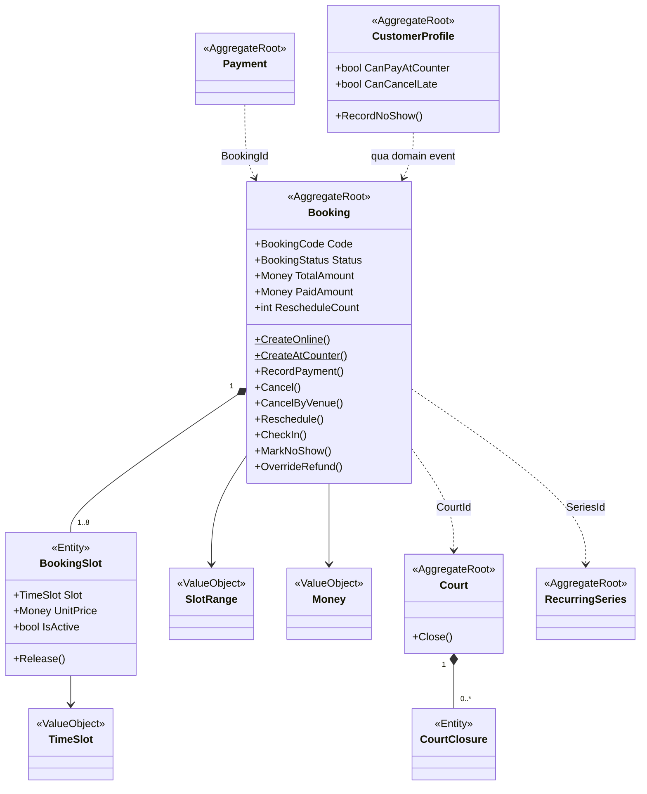

# 07 — Mô hình miền (Domain Model)

> **Thứ tự thiết kế:** `Business Rules → Domain Model → Database Schema`.
> Bảng chỉ là **cách lưu** của domain, không phải ngược lại.
>
> Tài liệu này là kết quả của một buổi phân tích ranh giới aggregate. Mọi quyết định đều kèm **lý do** — đó mới là phần có giá trị.

---

## 1. Ngôn ngữ chung (Ubiquitous Language)

Tên class ở đây **trùng khít** với cột "Trong code" của [00-glossary.md](00-glossary.md). Không có từ đồng nghĩa.

| Nghiệp vụ | Trong code | Loại |
|---|---|---|
| Đơn đặt sân | `Booking` | Aggregate Root |
| Khung giờ 30 phút | `TimeSlot` | Value Object |
| Sân | `Court` | Aggregate Root |
| Cụm sân | `Branch` | Aggregate Root |
| Chuỗi đặt định kỳ | `RecurringSeries` | Aggregate Root |
| Hồ sơ khách theo chủ sân | `CustomerProfile` | Aggregate Root |
| Giao dịch thanh toán | `Payment` | Aggregate Root |
| Dời lịch | `Booking.Reschedule()` | Method |
| Ghi đè hoàn tiền | `Booking.OverrideRefund()` | Method |

---

## 2. Bounded Context / Module

Chia theo **nghiệp vụ**, không theo tầng kỹ thuật.

| Module | Sở hữu dữ liệu | Giao tiếp ra ngoài |
|---|---|---|
| **Identity** | `AppUser`, `RefreshToken`, `Membership`, `UserBranchScope` | Cung cấp `ICurrentUser` |
| **Catalog** | `Branch`, `Court`, `CourtClosure`, `PriceRule` | Interface `IPricingService`, `ICourtAvailability` |
| **Booking** | `Booking`, `BookingSlot`, `RecurringSeries`, `CustomerProfile` | Domain event |
| **Payment** | `Payment`, `Refund`, `PaymentWebhookEvent` | Domain event |
| **Reporting** | *(không sở hữu — chỉ đọc)* | — |
| **Notification** | — | Lắng nghe domain event |

**Quy tắc:** module **không** join thẳng bảng của nhau. Tham chiếu chéo bằng **Id**, không bằng object. Kiểm tra bằng architecture test (NFR-31).

---

## 3. Aggregate và ranh giới

### 3.1 Khung quyết định đã dùng

Với mỗi cặp object, hỏi theo thứ tự:

```
1. Có bất biến nào bắt buộc đúng NGAY LẬP TỨC giữa chúng không?
2. Kiểm tra bất biến đó có cần nhìn thấy TẤT CẢ phần tử con cùng lúc không?
3. Gom lại thì aggregate có to đến mức mỗi lần sửa phải nạp hàng trăm dòng không?
```

> ⚠️ Tiêu chí là **bất biến**, **không phải** quan hệ khoá ngoại. Đây là chỗ sai phổ biến nhất.

### 3.2 Bản đồ Aggregate

| Aggregate Root | Chứa bên trong | Bất biến tự bảo vệ |
|---|---|---|
| **`Booking`** | `BookingSlot[]` | Slot liên tiếp cùng sân (BR-02) · `IsActive` luôn khớp `Status` · số lần dời ≤ trần (BR-38) · `PaidAmount ≤ TotalAmount` |
| **`Court`** | `CourtClosure[]` | Các khoảng đóng không chồng lấn nhau |
| **`Branch`** | — | `OpenTime < CloseTime` |
| **`Payment`** | — | `Amount > 0` · `IdempotencyKey` duy nhất |
| **`RecurringSeries`** | — | `GeneratedUntil` chỉ tiến, không lùi (BR-24) |
| **`CustomerProfile`** | — | `NoShowCount ≥ 0` · quy tắc thu hồi cờ (BR-22) |
| **`AppUser`** | `RefreshToken[]` | Chuỗi xoay vòng token hợp lệ, phát hiện tái sử dụng |

### 3.3 Lý do từng ranh giới

#### ✅ `BookingSlot` **nằm trong** `Booking`

| Câu hỏi | Trả lời |
|---|---|
| Bất biến tức thì? | **Có, hai cái:** `BookingSlot.IsActive` phải luôn khớp `Booking.Status` *(lệch một mili-giây = slot bị khoá ma, rủi ro R-05)*; và các slot phải **liên tiếp, cùng sân** (BR-02) |
| Cần nhìn toàn bộ? | **Có** — không thể kiểm tra "liên tiếp" khi chỉ nhìn một slot |
| Aggregate có to quá? | Không — tối đa 8 slot (BR-33 giới hạn 240 phút) |

→ Không có `booking.Slots.Add(...)` từ bên ngoài. Chỉ có `booking.Reschedule(...)`, `booking.Cancel(...)`.

#### ✅ `Payment` **tách khỏi** `Booking`

Webhook từ cổng thanh toán về lúc 2 giờ sáng chỉ cập nhật `Payment` — không cần biết gì về `Booking`. `Payment` có `IdempotencyKey` riêng, vòng đời riêng, và **một đơn có nhiều lần thử thanh toán**.

> ⚠️ **Ngoại lệ có chủ đích — phải biết và giải thích được:**
> Ở luồng webhook (UC-10 bước 9), một transaction sửa **cả hai aggregate**: `Payment → Succeeded` và `Booking → Confirmed`. Điều này **vi phạm** quy tắc "một transaction một aggregate".
>
> **Chấp nhận có ý thức**, vì: đây là tiền. Nếu tách ra bằng domain event, sẽ có cửa sổ vài giây mà **tiền đã trừ nhưng đơn chưa xác nhận** — khách hoang mang và có thể bấm thanh toán lần nữa. Quy tắc DDD tồn tại để phục vụ tính đúng đắn; khi nó đi ngược lại tính đúng đắn thì nó nhường chỗ.
>
> Điều kiện để ngoại lệ này hợp lệ: **một CSDL duy nhất**. Khi nào tách `Payment` thành microservice riêng, ngoại lệ này hết hiệu lực và phải chuyển sang Saga.

#### ✅ `Court` **tách khỏi** `Branch` — dù có bất biến chung

Có một bất biến xuyên hai thực thể: **mã sân phải duy nhất trong một chi nhánh**. Theo câu hỏi 2 của khung, lẽ ra `Court` phải nằm **trong** `Branch`.

Nhưng câu hỏi 3 chặn lại: một chi nhánh 6 sân, mỗi sân có lịch riêng — gom lại thì mỗi lần thêm sân phải nạp cả cụm.

→ Tách ra, và **đẩy bất biến xuống CSDL**:
```sql
CREATE UNIQUE INDEX uq_court_code ON court(branch_id, code) WHERE deleted_at IS NULL;
```

#### ✅ `RecurringSeries` **tách khỏi** `Booking`

BR-25 nói rõ: buổi bị trùng thì **bỏ qua buổi đó, chuỗi vẫn chạy**. Nghiệp vụ **chấp nhận** chúng không nhất quán hoàn toàn → hai aggregate. `Booking` chỉ giữ `SeriesId` — tham chiếu bằng Id. FK **không** cascade delete (BR-26).

---

## 4. 🔑 Bất biến xuyên aggregate — thứ Domain KHÔNG bảo vệ được

Đây là phần quan trọng nhất của tài liệu này.

### Câu hỏi: aggregate nào bảo vệ **BR-06**?

> *Một sân + một khung giờ ⇒ tối đa MỘT đơn hiệu lực.*

### Trả lời: **không aggregate nào cả.**

Xung đột xảy ra giữa **hai `Booking` khác nhau**:

```
Aggregate A = Booking #1 : sân 3, 19:00   ← chỉ nhìn thấy slot của CHÍNH NÓ
Aggregate B = Booking #2 : sân 3, 19:00   ← chỉ nhìn thấy slot của CHÍNH NÓ

Theo định nghĩa, hai aggregate không nhìn thấy nhau.
```

Muốn một aggregate làm được, ranh giới phải là *"`Court` + toàn bộ booking của sân đó, mãi mãi"* — **vô hạn kích thước**, và mỗi lượt đặt sẽ khoá cả sân.

### Ba cách xử lý bất biến xuyên aggregate

| Cách | Dùng ở đây? |
|---|---|
| Gom vào một aggregate | ❌ Aggregate khổng lồ |
| **Đẩy xuống CSDL** *(unique index / constraint)* | ✅ **Chính là [ADR-0001](16-decision-records/0001-booking-concurrency-strategy.md)** |
| Nhất quán trễ + bù trừ (Saga) | ❌ Khách đến sân rồi mới báo "xin lỗi trùng lịch" |

### 📌 Nguyên tắc

> **Aggregate bảo vệ bất biến BÊN TRONG một thực thể.**
> **Bất biến GIỮA nhiều thực thể cùng loại phải do cơ sở dữ liệu bảo vệ.**

### Danh sách bất biến do hạ tầng gánh

| Bất biến | Cơ chế |
|---|---|
| **BR-06** — không đặt trùng | Partial unique index `uq_slot_no_double_booking` |
| **BR-37** — dời lịch nguyên tử | Cùng index đó + một transaction |
| Mã sân duy nhất trong chi nhánh | `uq_court_code` (partial, `WHERE deleted_at IS NULL`) |
| **BR-15** — idempotency thanh toán | `UNIQUE(idempotency_key)`, `UNIQUE(provider, event_id)` |
| **BR-28** — cách ly tenant | EF Core Global Query Filter + `SaveChanges` tự gán `TenantId` |
| **BR-32** — audit log | `SaveChangesInterceptor` — lập trình viên không thể quên |

---

## 5. Entity và Value Object

### 5.1 Bài kiểm tra phân biệt

> *"Nếu tôi thay object này bằng object khác có giá trị y hệt, có vấn đề gì không?"*
> **Không** → Value Object · **Có** → Entity

### 5.2 Value Object của dự án

| Value Object | Nhốt rule gì | Thay cho |
|---|---|---|
| **`TimeSlot`** | Bắt đầu tại `:00`/`:30`, luôn **30 phút** (BR-01) | `DateTimeOffset` trần |
| **`SlotRange`** | Tập slot **liên tiếp, cùng sân** (BR-02) · tính tổng thời lượng cho BR-33 | `List<TimeSlot>` trần |
| **`Money`** | `≥ 0` · `decimal` · chỉ cộng được khi cùng `Currency` · làm tròn nhất quán | `decimal` trần |
| **`PhoneNumber`** | Chuẩn hoá đầu số VN · **tự mask khi log** (NFR-23) | `string` |
| **`BookingCode`** | Định dạng `BK-YYMM-NNNN` | `string` |
| **`DateRange`** | `From < To` | Cặp field rời rạc trong `CourtClosure`, `RecurringSeries` |
| **`OpeningHours`** | `Open < Close` | Cặp field trong `Branch` |

### 5.3 Ví dụ: `TimeSlot`

```csharp
public sealed record TimeSlot
{
    public const int DurationMinutes = 30;                    // BR-01

    public DateTimeOffset StartUtc { get; }
    public DateTimeOffset EndUtc => StartUtc.AddMinutes(DurationMinutes);

    private TimeSlot(DateTimeOffset startUtc) => StartUtc = startUtc;

    public static TimeSlot Create(DateTimeOffset startUtc)
    {
        if (startUtc.Minute is not (0 or 30) || startUtc.Second != 0 || startUtc.Millisecond != 0)
            throw new DomainException("Slot phải bắt đầu tại mốc :00 hoặc :30");

        return new TimeSlot(startUtc.ToUniversalTime());
    }

    public bool IsAdjacentTo(TimeSlot next) => EndUtc == next.StartUtc;
}
```

> `TimeSlot.Create(At("18:17"))` **ném exception**. Trạng thái sai không tồn tại được — đây là *"make illegal states unrepresentable"*, mạnh hơn hẳn việc rải `if` ở tầng validator.

### 5.4 Phân biệt quan trọng

**Thời lượng 60/90/120 phút KHÔNG phải thuộc tính của `TimeSlot`.** Một `TimeSlot` luôn là 30 phút. Thời lượng của một lượt đặt = **số lượng slot** trong `SlotRange`.

| Khái niệm | Thuộc về |
|---|---|
| Một slot = 30′, mốc `:00`/`:30` | `TimeSlot` (BR-01) |
| Các slot liên tiếp, cùng sân | `SlotRange` (BR-02) |
| Tối thiểu 60′ ở cao điểm | Domain Service — cần biết bảng giá (BR-33) |

---

## 6. Hành vi của `Booking`

### 6.1 Bộ method

```csharp
public sealed class Booking   // Aggregate Root
{
    // ── Khởi tạo ──────────────────────────────────────────────
    public static Booking CreateOnline(
        CourtRef court, SlotRange slots, Money total,
        Guid customerUserId, DateTimeOffset now);              // BR-04, BR-07, BR-10

    public static Booking CreateAtCounter(
        CourtRef court, SlotRange slots, Money total,
        Guid customerUserId, Guid staffId, DateTimeOffset now); // BR-13

    // ── Tiền vào ──────────────────────────────────────────────
    public void RecordPayment(
        Money amount, PaymentMethod method,
        Guid paymentId, DateTimeOffset now);                    // BR-10, BR-13, BR-38

    // ── Vòng đời ──────────────────────────────────────────────
    public void Expire(DateTimeOffset now);                                        // BR-11
    public void Cancel(string reason, DateTimeOffset now, Guid actorId);           // BR-16, BR-17
    public void CancelByVenue(string reason, DateTimeOffset now, Guid actorId);    // BR-18
    public void Reschedule(SlotRange newSlots, Money newTotal, DateTimeOffset now); // BR-36…BR-39
    public void CheckIn(DateTimeOffset now);
    public void MarkNoShow(DateTimeOffset now, Guid actorId);                      // BR-20, BR-21
    public void Complete(DateTimeOffset now);

    // ── Ngoại lệ do quản lý ───────────────────────────────────
    public void OverrideRefund(Money amount, string reason, Guid actorId);         // BR-40
}
```

### 6.2 Ba quyết định đặt tên và lý do

| Quyết định | Lý do |
|---|---|
| **Không có `SetStatus()`** | Nó cho phép **mọi** chuyển trạng thái — `Completed → PendingPayment` cũng được. Phá sạch state machine. Trạng thái chỉ đổi qua method nghiệp vụ. |
| **`Cancel` và `CancelByVenue` TÁCH riêng** | Chính sách hoàn tiền khác nhau hoàn toàn (BR-16 vs BR-18). Gộp lại phải truyền cờ `bool isByVenue` — **cờ boolean trong chữ ký method gần như luôn là dấu hiệu gộp nhầm hai hành động**. |
| **Ba method thanh toán GỘP thành `RecordPayment`** | Thanh toán online lần đầu, bù chênh lệch khi dời, thu tiền mặt tại quầy — cả ba đều `PaidAmount += amount`, cùng bất biến, cùng chỗ ghi audit. Khác nhau chỉ ở **kênh** → đó là **tham số**, không phải lý do tách method. |

> 📏 **Quy tắc phân biệt:** thân method **giống nhau**, chỉ khác một giá trị → giá trị đó là **tham số**. Thân method khác nhau về **quy tắc** → **tách**.

### 6.3 Hai method quan trọng nhất

```csharp
public void Cancel(string reason, DateTimeOffset now, Guid actorId)
{
    if (Status is not (BookingStatus.PendingPayment or BookingStatus.Confirmed))
        throw new DomainException("Chỉ hủy được đơn chờ thanh toán hoặc đã xác nhận");   // BR-17

    Status = BookingStatus.Cancelled;
    CancelledAt = now;
    CancelledBy = actorId;
    CancellationReason = reason;

    foreach (var slot in _slots) slot.Release();      // ⬅️ KHÔNG THỂ QUÊN — chống R-05

    Raise(new BookingCancelled(Id, TenantId, now));
}
```

```csharp
public void Reschedule(SlotRange newSlots, Money newTotal, DateTimeOffset now)
{
    if (Status != BookingStatus.Confirmed)
        throw new DomainException("Chỉ dời được đơn đã xác nhận");

    if (StartUtc - now < _rescheduleWindow)                                  // BR-36
        throw new DomainException("Đã quá hạn dời lịch");

    if (RescheduleCount >= _maxRescheduleCount)                              // BR-38
        throw new DomainException("Đã dời quá số lần cho phép");

    if (newSlots.StartUtc - now < _rescheduleWindow)                         // BR-38
        throw new DomainException("Slot mới quá sát giờ hiện tại");

    // ⚠️ Guard rẽ theo PaymentMode — đơn PayAtCounter chưa trả tiền vẫn được dời (BR-12)
    if (PaymentMode == PaymentMode.Prepaid && newTotal > PaidAmount)         // BR-38
        throw new DomainException("Chưa bù đủ tiền chênh lệch");

    foreach (var slot in _slots) slot.Release();       // giải phóng slot cũ
    _slots.Clear();
    _slots.AddRange(newSlots.ToBookingSlots(Id));      // chiếm slot mới

    StartUtc = newSlots.StartUtc;
    EndUtc   = newSlots.EndUtc;
    TotalAmount = newTotal;                            // BR-14: snapshot giá mới
    RescheduleCount++;
    LastRescheduledAt = now;
    // ⚠️ KHÔNG chạm NoShowCount — BR-42

    Raise(new BookingRescheduled(Id, TenantId, StartUtc, now));
}
```

> 🔒 **Tính nguyên tử (BR-37) KHÔNG do đoạn code này bảo đảm** — nó do **một transaction duy nhất** ở tầng Application cộng với **partial unique index** ở CSDL bảo đảm. Nếu slot mới đã bị chiếm, `SaveChangesAsync` ném `UniqueViolation` và **toàn bộ transaction rollback** — đơn cũ nguyên vẹn. Xem [ADR-0003](16-decision-records/0003-atomic-reschedule.md).

### 6.4 State machine



---

## 7. Domain Event

| Event | Ai phát | Ai nghe | Qua Outbox? |
|---|---|---|---|
| `BookingCreated` | `Booking` | Notification | ✅ |
| `BookingConfirmed` | `Booking` | Notification, Reporting | ✅ |
| `BookingRescheduled` | `Booking` | Notification | ✅ |
| `BookingCancelled` | `Booking` | Payment *(tạo Refund)*, Notification | ✅ |
| `BookingExpired` | `Booking` | Notification | ✅ |
| `NoShowRecorded` | `Booking` | `CustomerProfile` *(BR-22)* | ❌ nội bộ, cùng transaction |
| `PaymentFlagRevoked` | `CustomerProfile` | Notification | ✅ |
| `RefundRequested` | `Booking` | Payment worker | ✅ |

> Event **đi ra ngoài module** phải qua **Outbox** (ghi cùng transaction với dữ liệu — chống dual write). Event **trong cùng module, cùng transaction** thì xử lý trực tiếp.

---

## 8. Domain Service

Chỉ tạo khi logic **không thuộc về aggregate nào**.

| Domain Service | Trách nhiệm | Vì sao không nằm trong aggregate |
|---|---|---|
| **`PricingService`** | Chọn `PriceRule` thắng theo `priority`, nhân theo số slot, áp `HalfHourPriceRatio` (BR-14b), trừ giảm giá định kỳ 15% (BR-23) | Cần dữ liệu từ **module Catalog**, `Booking` không sở hữu |
| **`RefundPolicy`** | Tính mức hoàn theo bậc 24h/4h (BR-16), áp ưu đãi `CanCancelLate` (BR-35) | Cần cả `Booking` lẫn `CustomerProfile` — hai aggregate |

### ⚠️ Domain Service ≠ Application Service

| Việc | Tầng |
|---|---|
| Đọc `PriceRule` từ CSDL | **Infrastructure** *(repository)* |
| Điều phối: nạp rule → gọi tính → truyền vào `Booking` | **Application** *(handler)* |
| **Chọn rule nào thắng, nhân, áp giảm giá** | 🔴 **Domain Service** |

```
Application Handler:
  1. rules   = await _priceRuleRepo.GetActiveAsync(courtId, date);      // I/O
  2. total   = _pricingService.Calculate(newSlots, rules, tenant);      // THUẦN, test không cần DB
  3. booking.Reschedule(newSlots, total, now);                          // Domain
```

> 🔑 *"Domain không chạm hạ tầng"* nghĩa là **Domain không đi LẤY dữ liệu**. Dữ liệu được **mang tới** cho Domain. Domain vẫn giữ toàn bộ quyền quyết định trên dữ liệu đó.
>
> Nhầm chỗ này là cách phổ biến nhất để vô tình tạo ra **Anemic Domain Model** — và nó xảy ra với người **đã đọc** về Clean Architecture, không phải người chưa biết.

---

## 9. Sơ đồ lớp



*Nét liền = thành phần bên trong aggregate. Nét đứt = tham chiếu bằng **Id** giữa các aggregate.*

---

## 10. Ánh xạ Domain → Bảng

| Domain | Bảng | Ghi chú |
|---|---|---|
| `Booking` | `booking` | |
| `BookingSlot` | `booking_slot` | ⚠️ **Phi chuẩn hoá có chủ đích:** lặp `court_id` và `is_active` — vì partial unique index **không tham chiếu được bảng khác**. Xem [design-decisions.md §3](design-decisions.md) |
| `TimeSlot` | cột `slot_start_utc` | `EndUtc` là **thuộc tính tính toán**, không lưu |
| `Money` | 2 cột `amount` + `currency` | EF Core `ComplexProperty` (.NET 8+) |
| `SlotRange` | *(không lưu)* | Chỉ tồn tại trong bộ nhớ để bảo vệ BR-02 |
| `CustomerProfile` | `customer_profile` | Hai cờ **độc lập**: `can_pay_at_counter`, `can_cancel_late` |
| `OpeningHours` | `open_time` + `close_time` | `ComplexProperty` |
| `DateRange` | `from_utc` + `to_utc` | `ComplexProperty` |

---

## ✅ Tiêu chí hoàn thành

- [x] Mỗi `BR-xx` ánh xạ tới một chỗ xác định — xem bảng "Tầng nào gánh rule nào" ở [06-business-rules.md](06-business-rules.md)
- [x] Không có setter công khai trên aggregate root
- [x] Mọi ranh giới aggregate giải thích được bằng **bất biến**, không bằng khoá ngoại
- [x] Mọi Value Object có lý do tồn tại
- [x] Domain Event liệt kê đủ người nghe và cách truyền
- [x] Có ánh xạ sang schema, kể cả điểm phi chuẩn hoá
- [x] Tầng Domain sạch phụ thuộc hạ tầng *(kiểm bằng architecture test — NFR-30)*
- [x] **Nêu rõ ngoại lệ có chủ đích** *(Payment + Booking cùng transaction)*

---

## 💬 Câu hỏi phỏng vấn từ tài liệu này

1. Aggregate là gì? Bạn chọn ranh giới dựa trên tiêu chí nào?
2. Vì sao `BookingSlot` nằm trong `Booking` nhưng `Payment` thì tách ra?
3. **Bất biến "không đặt trùng sân" được bảo vệ ở aggregate nào?** *(→ không aggregate nào — đây là bất biến xuyên aggregate)*
4. Bạn có vi phạm quy tắc "một transaction một aggregate" không? Ở đâu, vì sao?
5. Entity và Value Object khác nhau ở đâu? Vì sao VO phải bất biến?
6. Anemic Domain Model là gì? Làm sao biết code mình có bị không?
7. Domain Service khác Application Service ở chỗ nào?
8. Vì sao không có method `SetStatus()`?
9. Vì sao `Cancel` và `CancelByVenue` tách riêng, nhưng ba method thanh toán lại gộp làm một?
