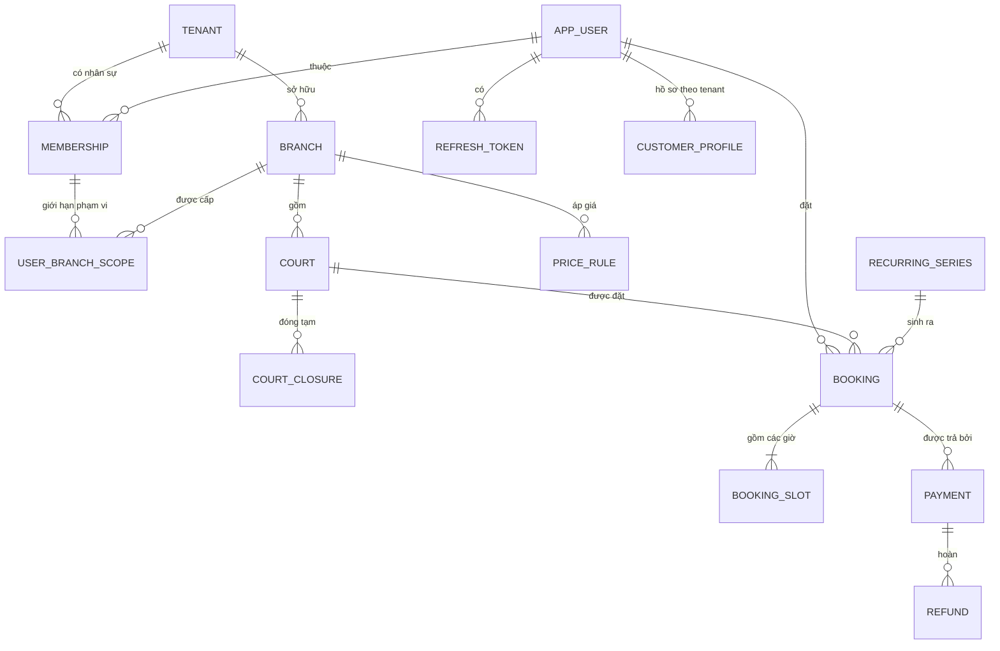
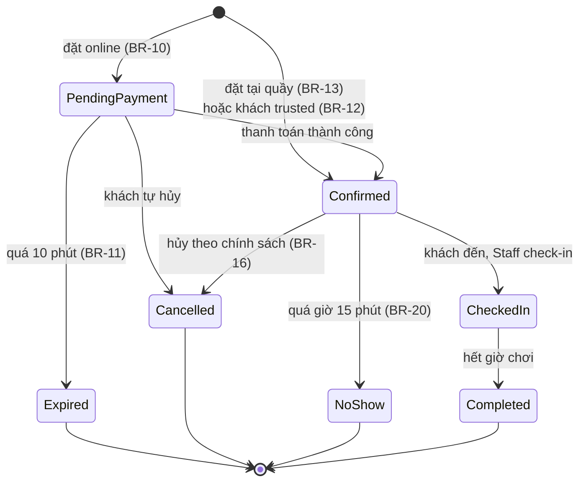

# Thiết kế cơ sở dữ liệu — v1

> PostgreSQL 16 · EF Core 9 · Mọi thời điểm lưu **UTC** (`timestamptz`)

---

## 1. Sơ đồ quan hệ



---

## 2. Nhóm bảng

### 2.1 Định danh & đa chủ sở hữu

```sql
-- Một chủ sở hữu kinh doanh. Chủ sân hiện tại = tenant 1. Chủ sân khác = tenant 2.
CREATE TABLE tenant (
    id           uuid PRIMARY KEY,
    name         varchar(200) NOT NULL,
    slug         varchar(60)  NOT NULL UNIQUE,   -- dùng cho subdomain sau này
    status       varchar(20)  NOT NULL,          -- Active | Suspended
    created_at   timestamptz  NOT NULL DEFAULT now(),

    -- ⚙️ Tham số chính sách — cấu hình theo tenant, KHÔNG hardcode (CR-07, CR-08)
    half_hour_price_ratio    numeric(4,3) NOT NULL DEFAULT 0.500,  -- BR-14b
    reschedule_window_hours  smallint     NOT NULL DEFAULT 2,      -- BR-36
    max_reschedule_count     smallint     NOT NULL DEFAULT 2,      -- BR-38
    hold_minutes             smallint     NOT NULL DEFAULT 10,     -- BR-11
    CONSTRAINT ck_tenant_ratio CHECK (half_hour_price_ratio > 0 AND half_hour_price_ratio <= 1)
);

-- Tài khoản đăng nhập. KHÔNG gắn tenant — một người có thể vừa là khách
-- của Cụm 1, vừa là nhân viên của tenant khác.
CREATE TABLE app_user (
    id              uuid PRIMARY KEY,
    phone_number    varchar(20)  NOT NULL UNIQUE,   -- 🔑 định danh chính
    phone_verified  boolean      NOT NULL DEFAULT false,
    email           varchar(200) NULL,              -- tuỳ chọn
    password_hash   varchar(255) NULL,              -- NULL nếu chỉ đăng nhập OTP
    full_name       varchar(150) NOT NULL,
    status          varchar(20)  NOT NULL,          -- Active | Locked
    created_at      timestamptz  NOT NULL DEFAULT now(),
    updated_at      timestamptz  NULL
);

CREATE TABLE refresh_token (
    id               uuid PRIMARY KEY,
    user_id          uuid NOT NULL REFERENCES app_user(id),
    token_hash       varchar(255) NOT NULL,      -- ⚠️ lưu HASH, không lưu token gốc
    expires_at       timestamptz  NOT NULL,
    revoked_at       timestamptz  NULL,
    replaced_by_id   uuid NULL REFERENCES refresh_token(id),  -- chuỗi xoay vòng
    created_by_ip    inet NULL,
    created_at       timestamptz NOT NULL DEFAULT now()
);
CREATE INDEX ix_refresh_token_user ON refresh_token(user_id) WHERE revoked_at IS NULL;

-- Người này giữ vai trò gì trong tenant nào
CREATE TABLE membership (
    id         uuid PRIMARY KEY,
    user_id    uuid NOT NULL REFERENCES app_user(id),
    tenant_id  uuid NOT NULL REFERENCES tenant(id),
    role       varchar(30) NOT NULL,   -- Owner | BranchManager | Staff | Partner
    status     varchar(20) NOT NULL,
    created_at timestamptz NOT NULL DEFAULT now(),
    CONSTRAINT uq_membership UNIQUE (user_id, tenant_id)
);

-- 🔶 Giới hạn phạm vi dữ liệu: Manager/Partner chỉ thấy các chi nhánh ở đây.
-- Owner KHÔNG có dòng nào ở bảng này ⇒ thấy toàn bộ tenant.
CREATE TABLE user_branch_scope (
    membership_id uuid NOT NULL REFERENCES membership(id) ON DELETE CASCADE,
    branch_id     uuid NOT NULL REFERENCES branch(id),
    PRIMARY KEY (membership_id, branch_id)
);
```

### 2.2 Danh mục sân

```sql
CREATE TABLE branch (
    id          uuid PRIMARY KEY,
    tenant_id   uuid NOT NULL REFERENCES tenant(id),
    name        varchar(150) NOT NULL,
    address     varchar(300) NOT NULL,
    phone       varchar(20)  NULL,
    open_time   time NOT NULL DEFAULT '05:00',    -- giờ địa phương
    close_time  time NOT NULL DEFAULT '23:00',
    time_zone   varchar(50) NOT NULL DEFAULT 'Asia/Ho_Chi_Minh',
    status      varchar(20) NOT NULL,             -- Active | Inactive
    deleted_at  timestamptz NULL,                 -- soft delete (BR-31)
    created_at  timestamptz NOT NULL DEFAULT now(),
    created_by  uuid NULL,
    updated_at  timestamptz NULL,
    updated_by  uuid NULL
);
CREATE INDEX ix_branch_tenant ON branch(tenant_id) WHERE deleted_at IS NULL;

CREATE TABLE court (
    id          uuid PRIMARY KEY,
    tenant_id   uuid NOT NULL REFERENCES tenant(id),
    branch_id   uuid NOT NULL REFERENCES branch(id),
    code        varchar(20)  NOT NULL,     -- "S1", "S2"
    name        varchar(100) NOT NULL,     -- "Sân 1 - gần cửa"
    court_type  varchar(20)  NOT NULL,     -- Indoor | Outdoor
    status      varchar(20)  NOT NULL,     -- Active | Maintenance | Inactive
    deleted_at  timestamptz NULL,
    created_at  timestamptz NOT NULL DEFAULT now(),
    created_by  uuid NULL,
    updated_at  timestamptz NULL,
    updated_by  uuid NULL
);
CREATE UNIQUE INDEX uq_court_code ON court(branch_id, code) WHERE deleted_at IS NULL;

-- Đóng sân tạm thời: bảo trì, mưa (sân ngoài trời), sự kiện (BR-08)
CREATE TABLE court_closure (
    id         uuid PRIMARY KEY,
    tenant_id  uuid NOT NULL,
    court_id   uuid NOT NULL REFERENCES court(id),
    from_utc   timestamptz NOT NULL,
    to_utc     timestamptz NOT NULL,
    reason     varchar(300) NOT NULL,
    created_by uuid NOT NULL,
    created_at timestamptz NOT NULL DEFAULT now(),
    CONSTRAINT ck_closure_range CHECK (to_utc > from_utc)
);
CREATE INDEX ix_closure_court_range ON court_closure(court_id, from_utc, to_utc);

-- Bảng giá. priority cao hơn thì thắng khi nhiều rule cùng khớp.
CREATE TABLE price_rule (
    id             uuid PRIMARY KEY,
    tenant_id      uuid NOT NULL,
    branch_id      uuid NULL REFERENCES branch(id),  -- NULL = áp cả tenant
    court_id       uuid NULL REFERENCES court(id),   -- NULL = áp cả branch
    day_of_week_mask smallint NOT NULL,  -- bitmask: CN=1, T2=2, T3=4 ... T7=64
    start_hour     smallint NOT NULL CHECK (start_hour BETWEEN 0 AND 23),
    end_hour       smallint NOT NULL CHECK (end_hour BETWEEN 1 AND 24),
    price          numeric(14,2) NOT NULL CHECK (price >= 0),  -- giá MỘT GIỜ
    -- BR-33: chặn phân mảnh lịch ở khung cao điểm
    min_duration_minutes smallint NOT NULL DEFAULT 60 CHECK (min_duration_minutes % 30 = 0),
    max_duration_minutes smallint NOT NULL DEFAULT 240 CHECK (max_duration_minutes % 30 = 0),
    priority       int NOT NULL DEFAULT 0,
    effective_from date NOT NULL,
    effective_to   date NULL,
    deleted_at     timestamptz NULL,
    created_at     timestamptz NOT NULL DEFAULT now(),
    CONSTRAINT ck_price_hours CHECK (end_hour > start_hour)
);
CREATE INDEX ix_price_rule_lookup
    ON price_rule(tenant_id, branch_id, court_id, priority DESC)
    WHERE deleted_at IS NULL;
```

### 2.3 Khách hàng

```sql
-- Quan hệ giữa một người và một chủ sân. Anh A có thể là khách ruột của
-- tenant 1 nhưng khách lạ của tenant 2 ⇒ không thể để cờ này trên app_user.
CREATE TABLE customer_profile (
    id             uuid PRIMARY KEY,
    tenant_id      uuid NOT NULL REFERENCES tenant(id),
    user_id        uuid NOT NULL REFERENCES app_user(id),
    -- ⚠️ HAI đặc quyền ĐỘC LẬP, hai lý do thu hồi độc lập (CR-08a)
    can_pay_at_counter boolean NOT NULL DEFAULT false, -- BR-12, thu hồi bởi BR-22
    can_cancel_late    boolean NOT NULL DEFAULT false, -- BR-35, ngưỡng thu hồi riêng
    no_show_count  int     NOT NULL DEFAULT 0,
    last_no_show_at timestamptz NULL,
    total_bookings int     NOT NULL DEFAULT 0,
    note           varchar(500) NULL,
    created_at     timestamptz NOT NULL DEFAULT now(),
    updated_at     timestamptz NULL,
    CONSTRAINT uq_customer_profile UNIQUE (tenant_id, user_id)
);
```

### 2.4 Booking — trái tim hệ thống

```sql
CREATE TABLE recurring_series (
    id               uuid PRIMARY KEY,
    tenant_id        uuid NOT NULL,
    branch_id        uuid NOT NULL REFERENCES branch(id),
    court_id         uuid NOT NULL REFERENCES court(id),
    customer_user_id uuid NOT NULL REFERENCES app_user(id),
    day_of_week      smallint NOT NULL CHECK (day_of_week BETWEEN 0 AND 6),
    start_hour       smallint NOT NULL,
    duration_hours   smallint NOT NULL CHECK (duration_hours BETWEEN 1 AND 6),
    start_date       date NOT NULL,
    end_date         date NULL,                       -- NULL = vô thời hạn
    discount_percent numeric(5,2) NOT NULL DEFAULT 15,
    status           varchar(20) NOT NULL,            -- Active | Cancelled
    generated_until  date NULL,                       -- BR-24: mốc rolling window
    created_at       timestamptz NOT NULL DEFAULT now(),
    created_by       uuid NOT NULL
);
CREATE INDEX ix_series_generation
    ON recurring_series(status, generated_until)
    WHERE status = 'Active';

CREATE TABLE booking (
    id                uuid PRIMARY KEY,
    tenant_id         uuid NOT NULL,
    branch_id         uuid NOT NULL REFERENCES branch(id),
    court_id          uuid NOT NULL REFERENCES court(id),
    customer_user_id  uuid NOT NULL REFERENCES app_user(id),
    booking_code      varchar(20) NOT NULL,     -- "BK-2607-0001" cho khách đọc qua điện thoại

    status            varchar(25) NOT NULL,
    -- PendingPayment | Confirmed | CheckedIn | Completed | Cancelled | NoShow | Expired

    start_utc         timestamptz NOT NULL,
    end_utc           timestamptz NOT NULL,

    total_amount      numeric(14,2) NOT NULL,   -- tổng giá gốc các slot
    discount_amount   numeric(14,2) NOT NULL DEFAULT 0,
    payable_amount    numeric(14,2) NOT NULL,   -- = total - discount
    paid_amount       numeric(14,2) NOT NULL DEFAULT 0,
    refund_amount     numeric(14,2) NOT NULL DEFAULT 0,

    payment_mode      varchar(20) NOT NULL,     -- Prepaid | PayAtCounter
    source            varchar(20) NOT NULL,     -- Online | Counter
    series_id         uuid NULL REFERENCES recurring_series(id),

    hold_expires_at   timestamptz NULL,         -- BR-11, chỉ có khi PendingPayment
    checked_in_at     timestamptz NULL,
    cancelled_at      timestamptz NULL,
    cancelled_by      uuid NULL,
    cancellation_reason varchar(300) NULL,

    -- 🔄 Dời lịch (CR-08b)
    reschedule_count  smallint NOT NULL DEFAULT 0,   -- BR-38, trần ở tenant.max_reschedule_count
    last_rescheduled_at timestamptz NULL,

    -- 🔑 Ghi đè hoàn tiền bởi BranchManager (BR-40)
    refund_override_amount numeric(14,2) NULL,       -- NULL = dùng mức tự động theo BR-16
    refund_override_by     uuid NULL,
    refund_override_reason varchar(300) NULL,        -- BẮT BUỘC khi có override

    row_version       integer NOT NULL DEFAULT 0,  -- optimistic concurrency

    created_at        timestamptz NOT NULL DEFAULT now(),
    created_by        uuid NOT NULL,
    updated_at        timestamptz NULL,
    updated_by        uuid NULL,

    CONSTRAINT ck_booking_range   CHECK (end_utc > start_utc),
    CONSTRAINT ck_booking_amounts CHECK (payable_amount >= 0 AND paid_amount >= 0),
    CONSTRAINT uq_booking_code    UNIQUE (tenant_id, booking_code)
);

-- Mỗi SLOT 30 PHÚT của booking là một dòng (BR-01). Booking 90 phút ⇒ 3 dòng.
-- Grain đổi từ 60′ xuống 30′ theo CR-07 — xem ADR-0002.
CREATE TABLE booking_slot (
    id             uuid PRIMARY KEY,
    booking_id     uuid NOT NULL REFERENCES booking(id) ON DELETE CASCADE,
    tenant_id      uuid NOT NULL,
    court_id       uuid NOT NULL,                 -- ⚠️ cố tình lặp lại từ booking
    slot_start_utc timestamptz NOT NULL,
    slot_end_utc   timestamptz NOT NULL,
    unit_price     numeric(14,2) NOT NULL,        -- BR-14: chốt giá tại thời điểm đặt
    is_active      boolean NOT NULL DEFAULT true  -- ⚠️ cố tình lặp trạng thái booking
);
```

### 2.5 🔒 Ràng buộc vàng — chống double booking

```sql
-- BR-06: Một sân + một khung giờ ⇒ tối đa MỘT slot đang hiệu lực.
-- Đây là tuyến phòng thủ CUỐI CÙNG và KHÔNG THỂ BỊ VƯỢT QUA.
-- Dù có bao nhiêu instance API, bao nhiêu luồng, bao nhiêu bug ở tầng ứng dụng,
-- PostgreSQL vẫn từ chối dòng thứ hai.
CREATE UNIQUE INDEX uq_slot_no_double_booking
    ON booking_slot (court_id, slot_start_utc)
    WHERE is_active;
```

> ✅ **Ràng buộc này sống sót qua CR-07 nguyên vẹn.** Đổi grain từ 60′ xuống 30′ chỉ đổi *ý nghĩa* của `slot_start_utc`, không đổi cấu trúc index. Đây là lợi ích của việc chọn kịch bản "căn mốc cố định" thay vì "giờ bắt đầu tự do" — xem [ADR-0002](16-decision-records/0002-slot-grain-30-minutes.md).

> 🔄 **Và chính index này làm luôn việc dời lịch nguyên tử (BR-37):** trong một transaction, `INSERT` slot mới rồi `UPDATE` slot cũ `is_active = false`. Nếu slot mới đã bị chiếm, `UniqueViolation` khiến **toàn bộ transaction rollback** — đơn cũ không hề bị đụng tới. Không cần thêm bất kỳ cơ chế nào. Xem [ADR-0003](16-decision-records/0003-atomic-reschedule.md).

`is_active` được đồng bộ với `booking.status`:

| `booking.status` | `is_active` | Slot có bị chiếm? |
|---|:--:|:--:|
| `PendingPayment` | `true` | ✅ Có (BR-07) |
| `Confirmed` / `CheckedIn` / `Completed` / `NoShow` | `true` | ✅ Có |
| `Cancelled` / `Expired` | `false` | ❌ Giải phóng |

### 2.6 Thanh toán

```sql
CREATE TABLE payment (
    id                uuid PRIMARY KEY,
    tenant_id         uuid NOT NULL,
    booking_id        uuid NOT NULL REFERENCES booking(id),
    amount            numeric(14,2) NOT NULL CHECK (amount > 0),
    currency          char(3) NOT NULL DEFAULT 'VND',
    method            varchar(20) NOT NULL,   -- VnPay | Momo | Cash | BankTransfer
    status            varchar(20) NOT NULL,   -- Pending | Succeeded | Failed | Cancelled
    provider_txn_id   varchar(100) NULL,
    idempotency_key   varchar(100) NOT NULL,  -- BR-15
    raw_response      jsonb NULL,
    created_at        timestamptz NOT NULL DEFAULT now(),
    completed_at      timestamptz NULL,
    CONSTRAINT uq_payment_idem UNIQUE (idempotency_key)
);
CREATE INDEX ix_payment_booking ON payment(booking_id);

CREATE TABLE refund (
    id                 uuid PRIMARY KEY,
    tenant_id          uuid NOT NULL,
    payment_id         uuid NOT NULL REFERENCES payment(id),
    amount             numeric(14,2) NOT NULL CHECK (amount > 0),
    reason             varchar(300) NOT NULL,
    status             varchar(20) NOT NULL,   -- Pending | Succeeded | Failed
    provider_refund_id varchar(100) NULL,
    created_at         timestamptz NOT NULL DEFAULT now(),
    completed_at       timestamptz NULL
);

-- Nhật ký webhook thô. Chống xử lý trùng + có bằng chứng khi đối soát.
CREATE TABLE payment_webhook_event (
    id           uuid PRIMARY KEY,
    provider     varchar(20) NOT NULL,
    event_id     varchar(150) NOT NULL,   -- id từ nhà cung cấp
    payload      jsonb NOT NULL,
    signature_ok boolean NOT NULL,
    received_at  timestamptz NOT NULL DEFAULT now(),
    processed_at timestamptz NULL,
    error        text NULL,
    CONSTRAINT uq_webhook_event UNIQUE (provider, event_id)
);
```

### 2.7 Hạ tầng: Outbox & Audit

```sql
-- Ghi trong CÙNG transaction với booking ⇒ không bao giờ mất event.
CREATE TABLE outbox_message (
    id             uuid PRIMARY KEY,
    tenant_id      uuid NULL,
    aggregate_type varchar(50)  NOT NULL,   -- "Booking"
    aggregate_id   uuid         NOT NULL,
    event_type     varchar(100) NOT NULL,   -- "BookingConfirmed"
    payload        jsonb        NOT NULL,
    occurred_at    timestamptz  NOT NULL DEFAULT now(),
    processed_at   timestamptz  NULL,
    attempt_count  int          NOT NULL DEFAULT 0,
    error          text         NULL
);
CREATE INDEX ix_outbox_unprocessed
    ON outbox_message(occurred_at)
    WHERE processed_at IS NULL;

CREATE TABLE audit_log (
    id             bigserial PRIMARY KEY,
    tenant_id      uuid NULL,
    actor_user_id  uuid NULL,
    action         varchar(80)  NOT NULL,   -- "Booking.Cancel"
    entity_type    varchar(50)  NOT NULL,
    entity_id      varchar(60)  NOT NULL,
    before_value   jsonb NULL,
    after_value    jsonb NULL,
    ip_address     inet NULL,
    correlation_id varchar(60) NULL,        -- nối với log Serilog
    created_at     timestamptz NOT NULL DEFAULT now()
);
CREATE INDEX ix_audit_entity ON audit_log(entity_type, entity_id, created_at DESC);
CREATE INDEX ix_audit_tenant_time ON audit_log(tenant_id, created_at DESC);
```

---

## 3. Chiến lược index

| Index | Phục vụ truy vấn | Ghi chú |
|---|---|---|
| `uq_slot_no_double_booking` | **Ràng buộc bất biến BR-06** | Vừa là constraint vừa là index tra cứu lịch trống |
| `booking(tenant_id, branch_id, start_utc)` | Lịch của cụm sân theo ngày | Truy vấn nóng nhất của Staff |
| `booking(status, hold_expires_at) WHERE status='PendingPayment'` | Job dọn đơn quá hạn | **Partial index** — chỉ vài chục dòng thay vì cả bảng |
| `booking(customer_user_id, start_utc DESC)` | "Đơn của tôi" | |
| `app_user(phone_number)` UNIQUE | Đăng nhập | |
| `ix_outbox_unprocessed` | Bộ đẩy outbox | Partial — bảng có triệu dòng nhưng index chỉ vài dòng chưa xử lý |
| `ix_price_rule_lookup` | Tính giá | |

```sql
CREATE INDEX ix_booking_branch_time  ON booking(tenant_id, branch_id, start_utc);
CREATE INDEX ix_booking_expiry       ON booking(hold_expires_at)
                                     WHERE status = 'PendingPayment';
CREATE INDEX ix_booking_customer     ON booking(customer_user_id, start_utc DESC);
CREATE INDEX ix_slot_court_time      ON booking_slot(court_id, slot_start_utc);
```

---

## 4. Vòng đời trạng thái Booking



**Quy tắc:** `Cancelled` và `Expired` là trạng thái **giải phóng slot** → phải set `booking_slot.is_active = false` **trong cùng transaction**.

---

## 5. Những gì cố tình **KHÔNG** làm ở v1

| Không làm | Vì sao |
|---|---|
| Bảng `court_availability` sinh sẵn mọi slot | 15 sân × 36 slot × 365 ngày ≈ 197k dòng/năm chỉ để lưu "trống". Không cần — suy ra từ `booking_slot` là đủ và luôn đúng. |
| Bảng `tenant_setting` dạng key-value tổng quát | Mới có 4 tham số chính sách. Cột có kiểu rõ ràng, có `CHECK`, validate được. Chuyển sang bảng động khi vượt ~15 tham số. |
| Cột `deposit_amount` riêng cho tiền cọc | "Trừ cọc" **chính là** bậc hoàn tiền BR-16 — không phải khái niệm thứ hai. Thêm cột riêng là tạo hai nguồn sự thật về cùng một số tiền. |
| Partition bảng `booking` theo tháng | ~40k dòng/năm. Postgres cười vào mặt con số này. Làm khi > 10 triệu dòng. |
| Bảng riêng cho `role` / `permission` | 4 vai trò cố định, dùng enum trong code. Bảng động chỉ cần khi khách tự tạo vai trò. |
| Event sourcing cho Booking | Quá sức cho v1. `audit_log` đã đủ để truy vết. |
| Read replica / CQRS tách CSDL đọc-ghi | Tải ~110 đơn/ngày. CQRS ở đây chỉ tách **code**, không tách **database**. |
